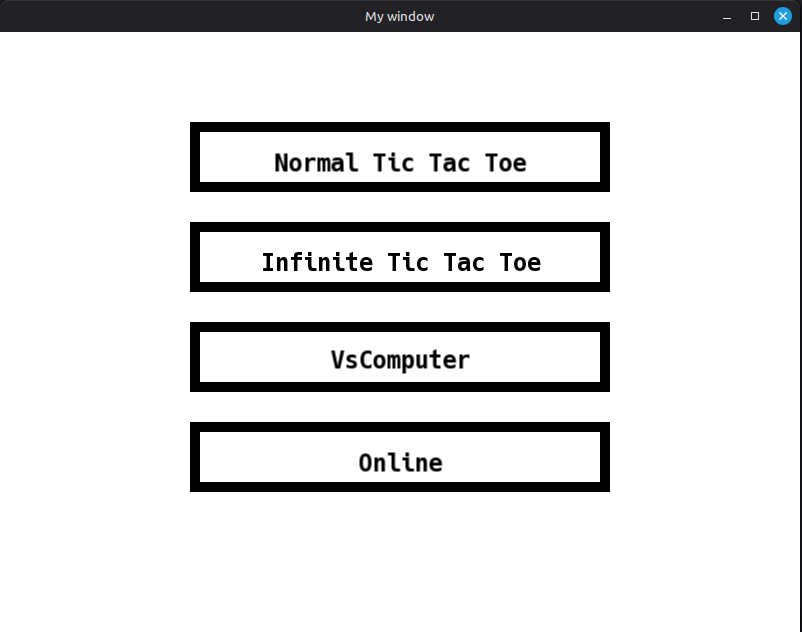
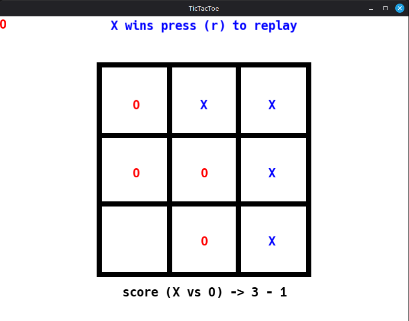
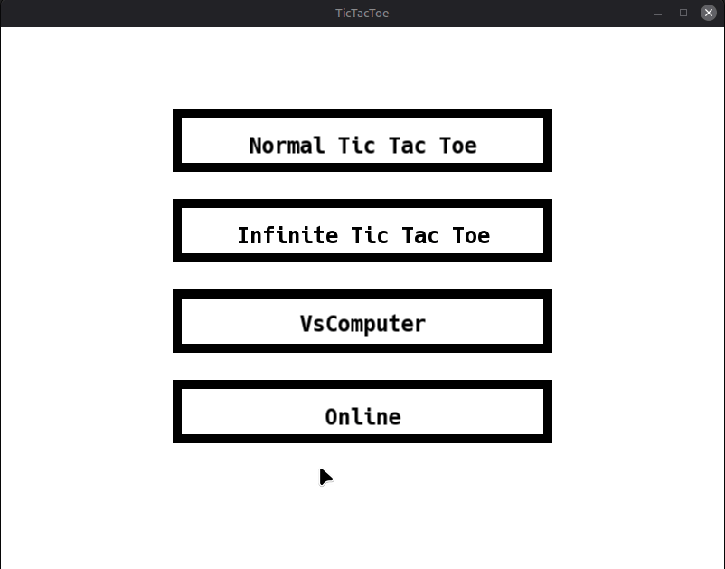
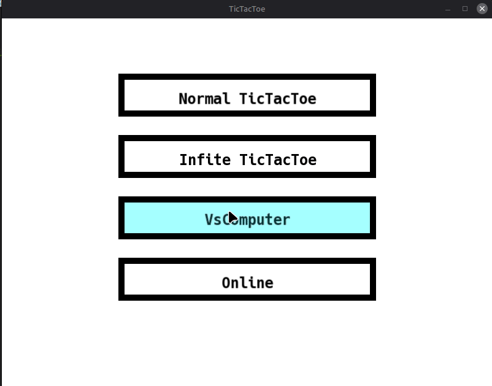

First game : **TicTacToe**

to build and run, excute the following :

```bash
mkdir build 
cd build
cmake ..
make
./bin/main #will change the name of the excutable later
```
Images of game:

  

  

**Infinite Tic Tac Toe**
<p align="center">
  
</p>

**All dificulties of VsComputer mode**
<p align="center">
  
</p>


---
Commits and progression:
---

On commit [bff069](https://github.com/FIRMach16/Games/commit/bff06970c9d8ced99ad650dc80b3520844b4c6d1) :
I refactored the code following the directions of Perplexity AI, the goal was to improve readability (example: changed 
mode from int to an enum class where the labels have direct relevance) , type safety (#define is not type safe , changed with constexpr (type)), portability (instead of defining 36 boundaries for the boxes of the TTT grid I used IILE (Immedialtely Invoked Lambda Expression) to define the boxes' bounds) and reduce redundacy (only one function is used to draw centered text)
I also added some minor features like menu items' highlighter.

On Commit [66c53a0](https://github.com/FIRMach16/Games/commit/66c53a05c65e8b5b3787b7dd7839d77bd5643d79)
Added score feature in NormalTTT , for drawing text a better way would've been to make an IILE to define safe zones to draw text instead of manually defining them each time I
want to draw something. Next infinteTTT...

On Commit [43edc76](https://github.com/FIRMach16/Games/commit/43edc76a8d99eb5b3b9b551e5662c2c0af76c36d)
Infinite TTT game mode complete , although the handler for mouse click is starting to look very crowded with some elements repeating , next vs computer mode (dumb algorithms and if possible AI wil make it available in Infinite and Normal TTT)

From Commit [a5c2f79](https://github.com/FIRMach16/Games/commit/a5c2f793af0b18d15147fdda470396d294ceffb1) to [eec90ff](https://github.com/FIRMach16/Games/commit/eec90ff5baf36597c62b311456527cf5cf47ae46) : Computer Mode with the strategy design pattern for 3 strategies for classical Tic Tac Toe (1 : one move winner or random move, 2: one move winner and one move win blocker or random move, 3 : minmax algorithm for unbetable strategy (lacks alpha-beta prunning for now)) , next major refactor (switching to MVC architecture for code sperartion and ease of maintainablity)...  

From Commit [9aa93de](https://github.com/FIRMach16/Games/commit/9aa93deffe6b1cb8d9b1dea457a8e46506b68fdf) to [6dcfde4](https://github.com/FIRMach16/Games/commit/6dcfde4ff0966369d61ecfbb113ff802aabaaf4d) : Refactored the code following the MVC architecture for better code seperation and easier time when adding features or fixing bugs next Online Mode + adding some other functionalities...
